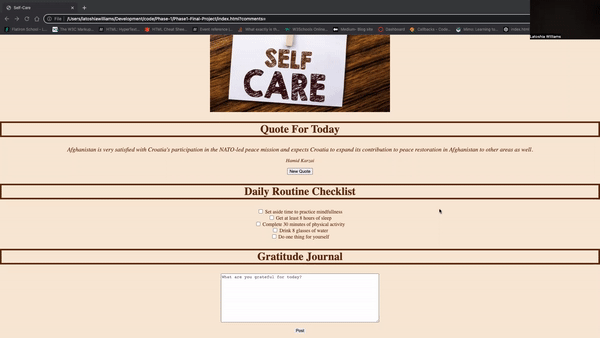
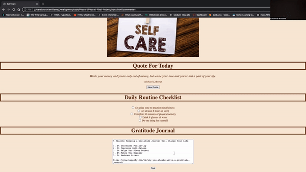

## PRIORITIZE YOUR DAILY SELF-CARE
True self-care is different each day. However, there are things that we can practice daily to ensure that show up are the best versions of ourselves. This application will give you the starting blocks of creating a daily routine.

### FEATURES

* Will generate a motivational quotes upon opening the page. Can also retrive a new quote with the click of a button
* Daily check list of daily items we should strive to complete. Regardless, if one task or all the tasks are completed, will receive encourgaging words.
* Gratitude journal to post what you are grateful for that day.

### HOW TO USE
1. Upon load of the page, a motivationl quoate with author will appear. To generate new quote, click the "New Quote" button.

2. The Daily Checklist Routine. Clicking on any of the checkboxes will put a checkmark to signify the item has been completed. A motivational message of "Great Work!" will also appear.

3. The Gratitude Journal is where the user a type out what they are grateful for that day. The text will be posted below this section for reflection.

**_Note: This app is a SPA (single page application)_**

